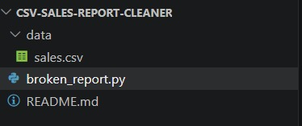
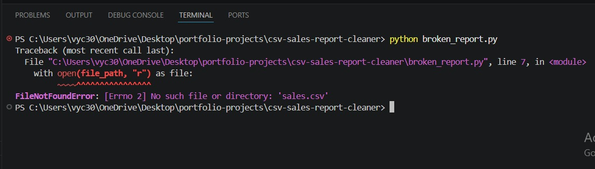
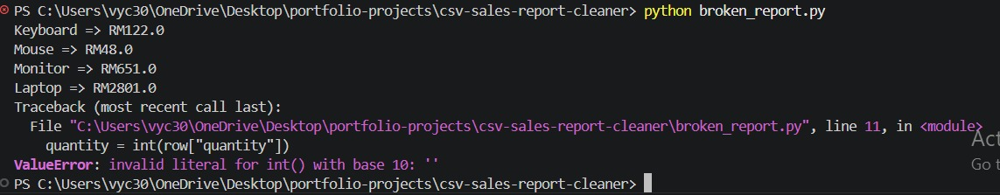
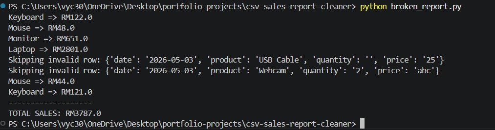
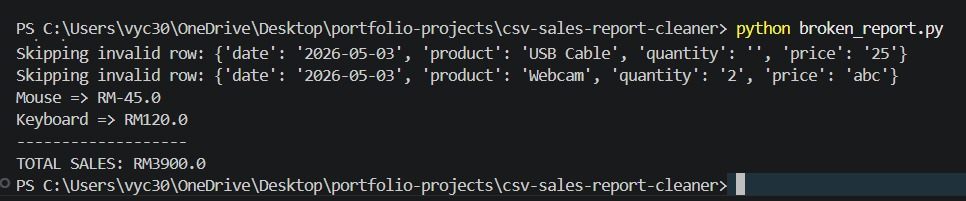
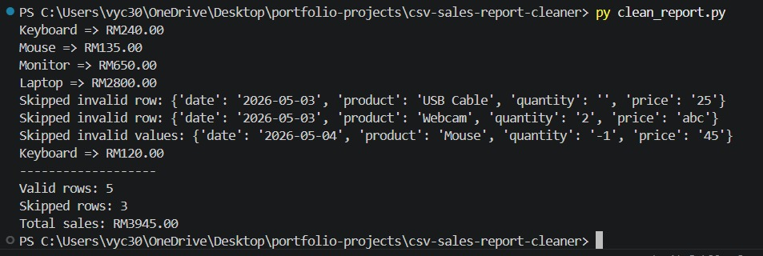

# CSV Sales Report Cleaner

A Python debugging and cleanup case study.

This project simulates a debugging task where a broken Python sales report script was analyzed, fixed, cleaned up, and improved.

The original script had several realistic issues:
- Wrong file path
- Crashes from missing CSV data
- Invalid numeric values
- Incorrect sales calculations
- Negative quantity handling problems
- Messy and unsafe code structure

The final cleaned version safely processes CSV sales data, skips invalid rows, and generates a cleaner sales summary report.

---

# Project Goal

The goal of this project was to practice:

- Python debugging
- Reading CSV files
- Error handling
- Data validation
- Refactoring messy code
- Improving script reliability
- Explaining root causes clearly

This project was intentionally kept small and practical to reflect real beginner freelance debugging work.

---

# Technologies Used

- Python 3
- CSV module
- pathlib

---

# Folder Structure

```text
csv-sales-report-cleaner/
│
├── data/
│   └── sales.csv
│
├── screenshots/
│
├── broken_report.py
├── clean_report.py
└── README.md
```

---

# Problems Found in the Original Script

## 1. Wrong File Path

The script attempted to load:

```python
file_path = "sales.csv"
```

But the actual CSV file was stored inside:

```text
data/sales.csv
```

This caused a `FileNotFoundError` and prevented the script from running.

---

## 2. Script Crashed on Missing Data

One CSV row had a missing quantity value:

```csv
2026-05-03,USB Cable,,25
```

The script attempted to convert an empty value into an integer:

```python
quantity = int(row["quantity"])
```

This caused a `ValueError`.

---

## 3. Incorrect Sales Calculation Logic

The original script used:

```python
sale_total = quantity + price
```

This is wrong, as the correct one shoud be multiplying quantity and price.

This produced incorrect sales totals such as:

```text
Keyboard => RM122.0
```

Instead of:

```text
Keyboard => RM240.0
```

---

## 4. Invalid Data Was Not Validated

The original script accepted negative quantity values such as:

```csv
Mouse,-1,45
```

This created invalid negative sales totals.

---

## 5. Poor Error Handling

The original script completely stopped when encountering invalid rows instead of safely skipping bad data.

This made the script unreliable for real-world CSV files.

---

# Improvements Made

The cleaned version of the script introduced several improvements:

| Problem | Fix |
|---|---|
| Wrong file path | Used `pathlib` for safer file handling |
| Script crashing on bad data | Added `try/except` error handling |
| Invalid rows stopping execution | Safely skipped invalid rows |
| Incorrect sales calculations | Fixed logic to use multiplication |
| Negative quantity values | Added validation checks |
| Messy structure | Refactored into a reusable function |
| Unclear output | Improved formatting and summary reporting |

---

# Before vs After

## Before

- Script crashed on missing values
- Invalid rows stopped execution
- Sales totals were incorrect
- Negative quantities were accepted
- File path issue prevented execution
- Output formatting was unclear

## After

- Invalid rows are safely skipped
- Correct sales totals are calculated
- Negative values are rejected
- Cleaner and safer code structure
- Improved terminal output
- Summary reporting added
- Script is more reliable and maintainable

---

# Screenshots

## Project Structure



---

## File Path Error

The original script failed because the CSV path was incorrect.



---

## Missing Data Crash

The script crashed when attempting to convert empty CSV values into integers.



---

## Incorrect Sales Calculation

The original logic incorrectly added quantity and price instead of multiplying them.



---

## Negative Quantity Problem

The script accepted invalid negative quantity values.



---

## Final Clean Output

The cleaned script safely skips invalid rows and produces cleaner reporting.



---

# How to Run

## Run the Broken Version

```bash
python broken_report.py
```

## Run the Clean Version

```bash
python clean_report.py
```

---

# Skills Demonstrated

- Python debugging
- CSV data processing
- Error handling
- Data validation
- Root cause analysis
- Refactoring
- Improving code readability
- Defensive programming
- Writing cleaner terminal output

---

# Portfolio Positioning

This project was designed as a simulated debugging and cleanup case study.

The focus was not building a large application, but instead demonstrating the ability to:
- identify bugs
- explain root causes
- clean up messy code
- improve reliability
- handle imperfect real-world data